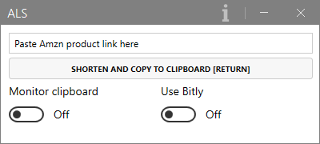

# Amzn Link Shortener

This Windows app shortens product links from Amazon to a shorter URL ready to be shared with others by 
any messenger, email or whatever.

## Requirements

This app was made with C# for Microsoft´s .NET Core 3.1. You may have to download and install the 
desktop runtime for your operating system: https://dotnet.microsoft.com/download/dotnet/3.1/runtime

It was tested under Windows 10 (32 and 64 bit) and Windows 11 (64 bit). 
It may or may not run under Linux, too, if you build the source code under Linux.

## Installation

Download the zip file from [Releases](https://github.com/elpatron68/AmznLinkShortener/releases/latest), 
extract it and create a shortcut to `AmznLinkShortener.exe` in your start menu or create a desktop icon.

## Usage

Start the app, copy a link from an Amazon product page, paste it to *Amzn Link Shortener* and hit `RETURN` 
or click the button:

The shortened link will automatically be copied to the clipboard and will overwrite the former content. 
Use it by pasting it wherever you like.

### Toggles

- If the checkbox *Monitor clipboard* is activated, the app will monitor the clipboard in the background, 
shorten any Amazon link it finds and paste the shortened link back to the clipboard.
- If *Use Bitly* is activated, the links created are even shorter, like `https://amzn.to/3AlOcx7`. 
Bitly shortening requires the usage of a personal API key to use this service. The binary release of 
*Amzn Link Shortener* uses the author´s personal API key, which results in the fact, that 
**all URL transformations and clicks are listed in the author´s API console**. So it´s highly recommended 
to create an own free Bitly account, get a personal API token, copy the file `Apikey_sample.cs` 
to_`Apikey.cs`, insert the private token there and build the project from source using *Visual Studio*.

## Technical Information

*Amzn Link Shortener* searches the clipboard text for two regular expressions. 
If the clipboard contains `https\:\/\/[a-z]+\.amazon\.[a-z]{2,3}` and a unique product 
identification string (matching `B[A-Z0-9]{9}`), it will construct the short URL from `https://` plus 
the host name from the original URL (`amazon.com`, `amazon.uk`, ...) plus `/dp/` plus 
the product identification from the second *RegEx*.

## License

This app is licensed under GPL v3, see [License.txt](License.txt)